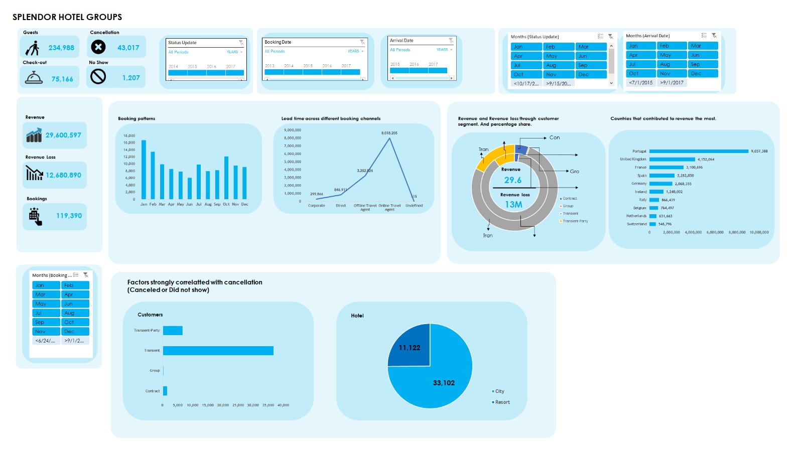

**_Disclaimer_**: This is a personal project on data analysis to test my skill in data cleaning, modelling, visualization and how to use data to generate relevant information to help business take wise and informed decision. 

# SPLENDOR HOTEL GROUP

## Introduction
Greetings from Splendor Hotel Groups (SHG). As a recently recruited Business Intelligence Analyst and Data Analyst, you will be essential to our efforts to solve the puzzles buried in our booking data. Renowned hospitality company SHG aims to improve visitor experiences and streamline corporate processes by utilizing data-driven insights. Your task is to thoroughly examine one of our best resorts' past booking data in order to identify trends, comprehend consumer behavior, and offer useful suggestions for tactical decision-making.

## Problem Statement
### Booking Patterns:
- What is the trend in booking patterns over time, and are there specific seasons or months with increased booking activity?
-	How does lead time vary across different booking channels, and is there a correlation between lead time and customer type?

### Cancellation Analysis:
-	What factors are most strongly correlated with cancellations, and can we predict potential cancellations based on certain variables?
-	How does the revenue loss from cancellations compare across different customer segments and distribution channels?

### Revenue Optimization:
-	What is the overall revenue trend, and are there specific customer segments or countries contributing significantly to revenue?
-	Can we identify optimal pricing strategies based on the Average Daily Rate (ADR) for different customer types and distribution channels?

## Skills/Concepts Demonstrated
only one tool was used for this project and some few concepts:
- Excel was used to wrangle the data, explore the data, and build the customer segmentation model.
  - The data was turned into a table, the fact table
  - The dimension table was created with pivot table
- Excel was used to create visualizations for presentation.

## Data Sourcing
[SHG_Booking_Data.xlsx](https://github.com/tsefaye99/SPLENDOR-HOTEL-GROUP/files/13579000/SHG_Booking_Data.xlsx)

## Analysis and Visualizations

### Booking Pattern Analysis
- The booking pattern is a positive one, over 100k+ booking in a period of 5years.
- January, February and October are the months with the highest booking activities with each experiencing over 10k+ bookings.

