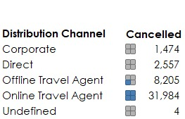
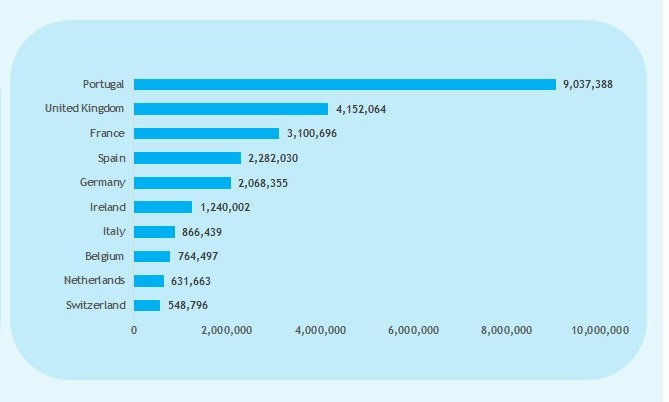

**_Disclaimer_**: This is a personal project on data analysis to test my skill in data cleaning, modelling, visualization and how to use data to generate relevant information to help business take wise and informed decision. 

**Note:** _Not all files(images) uploaded was used._

# SPLENDOR HOTEL GROUP

## Introduction
Greetings from Splendor Hotel Groups (SHG). As a recently recruited Business Intelligence Analyst and Data Analyst, you will be essential to our efforts to solve the puzzles buried in our booking data. Renowned hospitality company SHG aims to improve visitor experiences and streamline corporate processes by utilizing data-driven insights. Your task is to thoroughly examine one of our best resorts' past booking data in order to identify trends, comprehend consumer behavior, and offer useful suggestions for tactical decision-making.

## Problem Statement
### Booking Patterns:
- What is the trend in booking patterns over time, and are there specific seasons or months with increased booking activity?
-	How does lead time vary across different booking channels, and is there a correlation between lead time and customer type?

### Cancellation Analysis:
-	What factors are most strongly correlated with cancellations, and can we predict potential cancellations based on certain variables?
-	How does the revenue loss from cancellations compare across different customer segment and distribution channels?

### Revenue Optimization:
-	What is the overall revenue trend, and are there specific customer segments or countries contributing significantly to revenue?

## Skills/Concepts Demonstrated
only one tool was used for this project and some few concepts:
- Excel was used to wrangle the data, explore the data, and build the customer segmentation model.
  - The data was turned into a table, the fact table
  - The dimension table was created with pivot table
- Excel was used to create visualizations for presentation.

## Data Sourcing
[SHG_Booking_Data.xlsx](https://github.com/tsefaye99/SPLENDOR-HOTEL-GROUP/files/13579000/SHG_Booking_Data.xlsx)

## Analysis and Visualizations

### Booking Pattern Analysis
- The booking pattern is a positive one, over 100k booking in a period of 5years.
- January, February and October are the months with the highest booking activities with each experiencing over 10k bookings.
  

### Cancellation Analysis
- Quite a lot of factors contributed to the cancellation, the lead time being a major factor which also correlates with the type of customer and the channel they used.
- Transient customers cancelled the mostly either before checking in or after spending a few days at the hotel. With over 30k cancelling.
- The transient party had over 6k cancels
- Contract had over a 1k and Group had an approximate of 60 customers cancelling.
- A common factor to this is the distribution channeling and the hotel type. The table and graph below shows the numbers respectively.

    Customer          | Distribution channels | Hotel
  :------------------:|:---------------------:|:-----------------------:
    |    | 

#### Revenue Loss 
- Transient and the online travel agents are the biggest contributors to the loss revenue of the SHG
- The group customers and the undefined channel are the least contributors. Numbers below.
  

### Revenue Optimization
- The revenue trend is a positive one, although we don't have account of previous years to compare. An approximate 30M revenue is a good one.
- The transient customers are the biggest contributors to the revenue with over 22M followed by the transient-party with over 5M
- The contract and group customers are the lowest contributors over 1M and over 100k respectively.
- The countries that contributed mostly to the revenue are mostly countries in the EuroZone with Portugal and UK leading the way. Graph below.

 Customer                 | Countries  
:------------------------:|:-------------------------:
 |   

## Recommendations
- The booking patterns in January is high but November and December's is low, that shows the hotel is not making itself a good destination for the holiday season visitors. This means there is no plan in place by the Hotel management for visitors in the holiday period, the management will need to make plans for holiday visitors as that will increase revenue.
- The lead time is to high, with over 12M days between customers to get the hotel, the hotel needs to expand to areas where there have a large number of customer but with a high lead time as a result of distance to cut short the lead time as that is a big reason for cancellation for many customers.
- Transient customers are the most important to the Hotel Group, the Group had a revenue loss of an approximate of 13M with over 12M coming only from cancellation. The Group needs to have a plan in place to curb that. The transient customers are the biggest contributors to that, on the one hand revenue comes in cause of the flexibility and other hand the losses comes from that too. The Hotel needs to adjust the flexibility to ensure that transient customers pay cancellation fee after checking in but also complementing that with additional amazing services as not to lose them to competitors. Create an experience that gives reasons to stay longer.
- With close to 30M in revenue, the EuroZone has shown to be the biggest contributing plays in, expansion is needed to increase revenue, where else other than the developing continent of Asia, with a rising middle class, countries like China, India, South Korea, Taiwan, Singapore and so on. It is best next stop for the Group to set up, at least three hotels (two in the city and one resort). Thailand and Singapore are the best location as there are not involved in tension politics on the continent and are open to all citizens of the countries on the continent. Thailand is also a hotbed for tourist so is Singapore.

Thank you.
